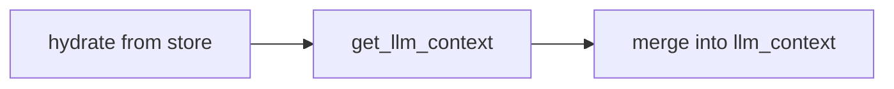

# Lifecycle of a memory request in penguiflow short-term memory

This document walks one full planner turn through penguiflow's short-term memory (STM) subsystem, from key resolution to background summarization and back to the next turn. It ties together the data structures, integration helpers, and runtime hooks that the existing `memory_management.md` and `MEMORY_GUIDE.md` explain in depth; it does not duplicate them.

## Phase 0. Prologue

### What the user sees
Memory in penguiflow is **opt-in**. When a `ReactPlanner` is configured with `short_term_memory=...`, prior user-assistant turns from the same session reappear inside the LLM context on the next request — so the planner sees recent dialogue, optional summaries of older turns, and (optionally) a digest of the trajectories that produced each answer.

### What happens behind
STM stores two primary record types: `ConversationTurn` (one per completed planner run) and `TrajectoryDigest` (compressed tool-call summary attached to a turn). All operations are async-first; the default implementation `DefaultShortTermMemory` lives entirely in-process and is keyed by a composite `MemoryKey`. Persistence is duck-typed against any object exposing `save_memory_state` / `load_memory_state` (see `penguiflow.state.protocol`). There is no broker, no embedding index, and no cron — STM is per-process and reactive only.

The key fields:

```python
@dataclass(slots=True)
class MemoryKey:
    tenant_id: str
    user_id: str
    session_id: str
    def composite(self) -> str: ...   # "{tenant}:{user}:{session}"

@dataclass(slots=True)
class ConversationTurn:
    user_message: str
    assistant_response: str
    trajectory_digest: TrajectoryDigest | None = None
    artifacts_shown: dict[str, Any] = ...
    artifacts_hidden_refs: list[str] = ...
    ts: float = 0.0
```

Strategy is one of `"none"`, `"truncation"`, or `"rolling_summary"`; isolation, budget, and summarizer parameters live on `ShortTermMemoryConfig`.

---

## Phase 1. Session opens

### What the user sees
A caller invokes the planner — typically via `ReactPlanner.run(query, *, memory_key=..., tool_context=...)` or the equivalent resume call. The caller may pass an explicit `MemoryKey`; otherwise STM tries to derive one from `tool_context`.

### What happens behind
Inside `react_runtime.py` the entry helpers call `_resolve_memory_key` (`planner/memory_integration.py:35`):

| Step | Key operation | Source ref |
|------|---------------|------------|
| explicit override | If caller passed a `MemoryKey`, return it unchanged | `memory_integration.py:_resolve_memory_key` |
| context extraction | Walk `tool_context` using `isolation.tenant_key` / `user_key` / `session_key` paths; require a non-empty session value | `memory_integration.py:_extract_memory_key_from_tool_context` |
| ephemeral fallback | When no key is available **and** `isolation.require_explicit_key=False`, generate `MemoryKey(tenant="default", user="anonymous", session=uuid4().hex)` once and cache it on the planner | `memory_integration.py:_resolve_memory_key` |
| no-key skip | If `require_explicit_key=True` and nothing was extracted, return `None` — STM is silently disabled for this request | same |

`_get_memory_for_key` (`memory_integration.py:58`) then resolves the actual store: a planner-wide singleton if one was supplied, otherwise a per-key `DefaultShortTermMemory` cached in `planner._memory_by_key[composite]`. Per-key instances are created lazily and survive across runs of the same planner instance.

---

## Phase 2. Request arrives

### What the user sees
The user submits a new query. Nothing about STM is exposed at this stage; the planner accepts the call as it would without memory.

### What happens behind
`react_runtime.py:_run_internal` (and `_resume_internal` for paused trajectories) normalises the incoming `llm_context` and `tool_context`, then calls `_resolve_memory_key` (Phase 1) and immediately follows with `_apply_memory_context`. The two helpers are sequential; nothing else touches STM until the planner finishes.

---

## Phase 3. Context assembly

### What the user sees
Mid-turn, before the LLM is called, the planner needs prior context. The planner reads STM and merges it into `llm_context.conversation_memory` so the LLM sees recent turns plus (optionally) a rolling summary.

### What happens behind
`_apply_memory_context` (`memory_integration.py:158`) runs the assembly in three steps:



| Node | Key operation | Sync/async | Source ref |
|------|---------------|------------|------------|
| hydrate | If `planner._state_store` is set and the memory exposes `hydrate`, call `store.load_memory_state(composite)` and replay via `from_dict`; warn-and-continue on failure | Async (state store) | `memory_integration.py:_maybe_memory_hydrate` |
| get_llm_context | Acquire memory lock; for `truncation` return `{recent_turns}`; for `rolling_summary` return `{recent_turns, pending_turns?, summary?}`; for `none` return `{}`; if health is `DEGRADED`, drop summary/pending and return only `recent_turns` | Async (lock) | `memory.py:get_llm_context` |
| merge | Shallow-merge the patch into a copy of `llm_context`; verify JSON-serialisability via `json.dumps`; on failure log `memory_context_not_json_serialisable` and return the original context unchanged | Sync | `memory_integration.py:_apply_memory_context` |

The shape returned to the LLM:

```json
{
  "conversation_memory": {
    "recent_turns": [
      {
        "user": "...",
        "assistant": "...",
        "trajectory_digest": {
          "tools_invoked": ["..."],
          "observations_summary": "...",
          "reasoning_summary": "...",
          "artifacts_refs": ["..."]
        }
      }
    ],
    "summary": "<session_summary>...</session_summary>",
    "pending_turns": [ /* same shape as recent_turns */ ]
  }
}
```

`recent_turns` always reflects the current `_turns` deque (capped at `budget.full_zone_turns` for `truncation`). `pending_turns` only appears for `rolling_summary` while turns wait for the background summarizer; it disappears once the summarizer succeeds (see Phase 6). `summary` is the last successful summarizer output, normalised into `<session_summary>...</session_summary>` tags.

---

## Phase 4. Planner composes

The ReAct loop runs as it normally does: tool calls, reasoning, validation, optional pause for HITL. STM is read-only inside this phase. Composition of the response is the planner's responsibility, outside STM's scope.

---

## Phase 5. Turn recording

### What the user sees
When the planner finishes, the completed exchange is added to STM so it can be recalled on the next request. Paused (`PlannerPause`) results are **not** recorded — only `PlannerFinish`.

### What happens behind
`_maybe_record_memory_turn` (`memory_integration.py:277`) is called from `react_runtime.py` after both `_run_internal` and `_resume_internal`. It runs a 3-step pipeline:

| Step | Key operation | Sync/async | Source ref |
|------|---------------|------------|------------|
| build turn | `_build_memory_turn`: extract `assistant_response` from `result.payload['raw_answer']` (or JSON-serialise the payload), fold trajectory steps into a `TrajectoryDigest` (only successful tool steps; observations truncated to 400 chars); skip digest if `include_trajectory_digest=False` | Sync | `memory_integration.py:_build_memory_turn` |
| add_turn | Acquire lock; append to `_turns`; fire `on_turn_added`; for `truncation` drop oldest beyond `full_zone_turns` and enforce budget; for `rolling_summary` evict overflow into `_pending` and schedule summarization | Async (lock + task) | `memory.py:add_turn` |
| persist | If `planner._state_store` is set and the memory exposes `persist`, call `store.save_memory_state(composite, to_dict())`; warn-and-continue on failure | Async (state store) | `memory_integration.py:_maybe_memory_persist` |

`add_turn` enforces budgets **before** persistence runs, so the persisted snapshot never exceeds `total_max_tokens` under `truncate_summary` / `truncate_oldest` policies. Under `overflow_policy="error"`, `MemoryBudgetExceeded` is raised inside `add_turn`; the surrounding `_maybe_record_memory_turn` catches the exception, logs `memory_add_turn_failed`, and skips persistence — the in-memory state is left as the strategy's truncation rules dictate.

`PlannerPause` results bypass both `add_turn` and `persist`; the resume path (Phase 2 again) re-applies memory context and only records once `PlannerFinish` is reached.

---

## Phase 6. Eviction & summarization (async)

### What the user sees
Nothing visible. After Phase 5 returns, the planner has already responded; summarization runs in the background and only affects the *next* call's context.

### What happens behind
For `strategy="rolling_summary"`, Phase 5's `add_turn` calls `_evict_to_pending_locked` and `_maybe_schedule_summarize_locked`:

1. **Evict.** While `len(_turns) > budget.full_zone_turns`, the oldest turn is moved from `_turns` to `_pending`. With `full_zone_turns=0`, all turns are evicted to `_pending` immediately.
2. **Schedule.** If no summarize task is in flight and `_pending` is non-empty, an `asyncio.create_task(_run_summarization())` is launched. The task runs outside the request lock.
3. **Summarize.** `_run_summarization_impl` snapshots `_pending` and `_summary`, then calls the configured summarizer. The default summarizer (`_get_short_term_memory_summarizer` in `memory_integration.py`) sends a structured-output request to the planner's LLM client (or a dedicated `summarizer_model` client if configured), parses a `_ShortTermMemorySummary` JSON response, and wraps the text in `<session_summary>...</session_summary>` tags.
4. **Commit.** On success, `_pending` is cleared, `_summary` is replaced, `_retry_count` resets to 0, the summary is truncated to `summary_max_tokens`, total budget is re-enforced, and `on_summary_updated` / `on_health_changed(HEALTHY)` callbacks fire.

`flush()` is the only caller-facing entry point that waits for in-flight summarization (used in tests and shutdown paths). It is best-effort: it returns immediately for `truncation` / `none` strategies and when health is `DEGRADED`.

For `strategy="truncation"` this phase is a no-op — `add_turn` already truncates synchronously. For `strategy="none"` the entire memory call chain short-circuits at the top of `add_turn`.

---

## Phase 7. Health & recovery

### What the user sees
When the summarizer LLM fails repeatedly, the planner stops surfacing `pending_turns` and `summary` in `conversation_memory` and falls back to the most recent turns only. The user sees no error; recall quality silently degrades until recovery succeeds.

### What happens behind
Health is tracked on `DefaultShortTermMemory._health` and transitions through four states:

```
HEALTHY ──summarizer raises──▶ RETRY ──retry_attempts exhausted──▶ DEGRADED
   ▲                              │                                    │
   │                              │ exponential backoff                │ degraded_retry_interval_s
   │                              ▼                                    │
   └────────────success──── RECOVERING ◀──────────────────────────────┘
```

| Trigger | Effect | Source ref |
|---------|--------|------------|
| Summarizer raises | `_handle_summarizer_failure` increments `_retry_count`; if ≤ `retry_attempts` move to `RETRY` and reschedule after `retry_backoff_base_s * 2^(attempt-1)`; otherwise move to `DEGRADED`, drain `_pending` into `_backlog` (capped at `recovery_backlog_limit`) | `memory.py:_handle_summarizer_failure` |
| `add_turn` while `DEGRADED` | Truncate to `full_zone_turns` and store overflow in `_backlog`; schedule recovery if `now - _last_degraded_attempt_ts >= degraded_retry_interval_s` | `memory.py:add_turn`, `_maybe_schedule_degraded_recovery_locked` |
| Recovery success | Move to `RECOVERING` while running, then `HEALTHY` on commit; clear `_backlog` instead of `_pending` | `memory.py:_run_summarization_impl` |
| `get_llm_context` while `DEGRADED` | Return `{conversation_memory: {recent_turns}}` only — no summary, no pending — so the LLM never sees stale or partial data | `memory.py:get_llm_context` |

`on_health_changed(old, new)` fires on every transition; surface this in your observability stack to alert on degraded summarization.

---

## Phase 8. Persistence

### What the user sees
If the planner is configured with a `state_store`, STM survives process restarts. The next time the same `MemoryKey` is used, hydration in Phase 3 replays prior turns, summary, and backlog from the store.

### What happens behind
`DefaultShortTermMemory.to_dict()` produces a versioned (`version: 1`) snapshot containing `health`, `summary`, `turns`, `pending`, `backlog`, and a `config_snapshot` (used for diagnostics, not for replaying config). `from_dict()` validates the shape, rejects mismatched versions, and rebuilds in-memory state — but resets `_summarize_task`, `_retry_count`, and `_last_degraded_attempt_ts` because in-flight tasks don't survive process boundaries.

The store contract is duck-typed: any object exposing `async save_memory_state(key, state)` and `async load_memory_state(key)` works. `penguiflow.state.in_memory.InMemoryStateStore` satisfies it for tests; production deployments typically point at a Redis-/Postgres-backed adapter.

Persistence is **fire-and-forget on the success path**: `_maybe_memory_persist` swallows exceptions and logs `memory_persist_failed`. A failed persist does not roll back the in-memory `add_turn`, so a process crash between `add_turn` and `save_memory_state` loses the turn. Phase 5's persistence is the only write site; there is no separate flush-on-shutdown hook.

---

## Phase 9. Next request

### What the user sees
The user sends another query. The planner re-runs Phases 1-5; the difference is what STM now holds.

### What happens behind
Goto Phase 1. The store the next request reads from has changed:

| From | Delta visible in the next request | Where it shows up |
|------|-----------------------------------|---------------------|
| Phase 5, add_turn | Latest `ConversationTurn` is in `_turns` (or evicted to `_pending`) | `recent_turns` / `pending_turns` in Phase 3 patch |
| Phase 6, summarization | Background task may have replaced `_pending` with a fresh `summary` | `summary` field in Phase 3 patch |
| Phase 7, degradation | `_health` may have flipped to `DEGRADED`; pending and summary are hidden | Phase 3 returns `recent_turns` only |
| Phase 8, persist | `state_store` has the post-turn snapshot | Phase 3 hydrate replays it on a fresh planner instance |

There is no overnight consolidation, no decay, no re-embedding. STM is reactive: every change is driven by a concrete `add_turn` or summarizer task launched from Phase 5/6.

---

## Side paths

### Singleton memory (planner-wide)
When `ReactPlanner(short_term_memory=<ShortTermMemory>)` receives an instance instead of a config, the planner uses that instance for **every** call regardless of `MemoryKey`. `_get_memory_for_key` short-circuits to the singleton. Use this for single-tenant CLIs or tests; never use it in multi-tenant deployments because cross-session isolation is bypassed.

### Ephemeral keys
With `MemoryIsolation(require_explicit_key=False)` and no extractable session in `tool_context`, the planner generates a single `MemoryKey(tenant="default", user="anonymous", session=uuid4().hex)` per planner instance and caches it on `planner._memory_ephemeral_key`. All requests without an explicit key share that one slot — useful for local dev, never appropriate for production multi-tenant traffic.

### Strategy = "none"
The fast path: `add_turn` and `get_llm_context` short-circuit to no-ops at the top of each method. `_resolve_memory_key` returns `None` immediately when neither a singleton nor a non-`none` strategy is configured, so no key is generated. Use this when you want the planner's lifecycle hooks to remain wired (for instrumentation) but want zero memory state.

### Trajectory digest opt-out
`include_trajectory_digest=False` skips the `TrajectoryDigest` build in Phase 5 and removes the `trajectory_digest` field from `_turn_to_llm_dict` output in Phase 3. Use this to reduce token cost on tool-heavy turns, at the cost of losing tool-invocation context across turns.

### Custom summarizer
`ShortTermMemoryConfig.summarizer_model` selects a dedicated client built in `react_init.py:614+` (DSPy auto-wires when the planner client is DSPy; otherwise `summarizer_model` must point to a model the planner's LLM client can dispatch). The wire-format is `Mapping[str, Any]` in / `Mapping[str, Any]` out, with keys `previous_summary`, `turns` (list of `_turn_to_llm_dict` outputs) on input and `summary` (string) on output. Replace via dependency injection if you need a non-LLM summarizer.

### Per-key vs per-planner state stores
The state store is wired on the planner (`planner._state_store`), not per-key. All keys persisted by the same planner share the same store; the `composite()` string is the namespace. If you need per-tenant stores, run separate planner instances or implement a router-style store that fans out by composite prefix.

### Pause / resume
`react_runtime.py:_resume_internal` re-runs `_resolve_memory_key` and `_apply_memory_context` against `trajectory.tool_context`, so resumed trajectories see the same `conversation_memory` patch they would have seen on a fresh run. Only `PlannerFinish` triggers `_maybe_record_memory_turn`; intermediate `PlannerPause` results never write to STM, so a long HITL pause does not pollute future recall with partial answers.

### Multi-tenant isolation
The composite key `{tenant}:{user}:{session}` is the *only* isolation boundary. Cross-tenant leakage requires either (a) a misconfigured singleton, (b) a state store that ignores the namespace, or (c) `require_explicit_key=False` collapsing distinct callers into the shared ephemeral key. Audit those three paths before shipping multi-tenant.

---

## Cross-reference

| Concern | File |
|---------|------|
| Types, protocols, default implementation | `penguiflow/planner/memory.py` |
| Key resolution, context apply, turn recording | `penguiflow/planner/memory_integration.py` |
| Wiring into the planner | `penguiflow/planner/react.py`, `penguiflow/planner/react_init.py` |
| Lifecycle entry points | `penguiflow/planner/react_runtime.py` (`_run_internal`, `_resume_internal`) |
| State-store contract | `penguiflow/state/protocol.py`, `penguiflow/state/in_memory.py` |
| Architecture deep dive | `docs/architecture/planning_orchestration/memory_management.md` |
| User-facing guide | `docs/MEMORY_GUIDE.md` |
