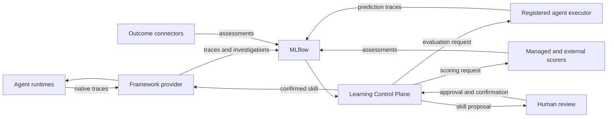

# Final Proposal: MLflow-Backed Learning Control Plane

- **Status:** Final architecture proposal
- **Date:** 2026-08-27
- **First iteration:** Advisory Agent Skills only
- **Related:**
  [Framework-Agnostic Learning Control Plane](./FRAMEWORK_AGNOSTIC_LEARNING_CONTROL_PLANE.md),
  [Learning Plane skill first](./Learning%20Plane%20skill%20first.md),
  [Dual Local and MLflow Evaluation Backends](./DUAL_LOCAL_MLFLOW_EVALUATION_BACKENDS.md)

## 1. Decision

Build a framework-agnostic **Learning Control Plane** with **MLflow as the
system of record for MLflow-native learning evidence**.

MLflow is the common evidence intermediary: it stores traces, curated datasets,
scorer assessments, evaluation runs, prediction traces, and their references.
The Learning Control Plane remains the workflow and authorization authority. It
selects evidence, proposes advisory skills, coordinates evaluation, verifies
lineage, and governs approval and delivery. Framework adapters execute agents
and deliver confirmed skills.

Domain knowledge does not move into the central service. Agent teams define
domain scorers and a small declarative learning profile. Managed MLflow scorers,
agent-owned scorers, and platform scorers can participate in the same learning
run.

Each agent owns its evaluation trace projection, dataset schema, predictor
inputs, expectations, and domain scorers as one versioned evaluation package.
The Learning Control Plane uses a separate structural
`InvestigationTrajectoryV1` only for cross-agent discovery and curation.

### Executive Constraints

The Learning Control Plane must remain framework-agnostic. Native traces,
evaluation datasets, replay semantics, scorers, and metrics vary by agent and
library. Centralizing them would couple the service to every framework and force
lossy lowest-common-denominator schemas. Agent-owned evaluation packages retain
those semantics and evolve them together.

The common boundary is therefore intentionally narrow:
`InvestigationTrajectoryV1` supports structural discovery, while the Learning
Control Plane orchestrates evidence and governance without interpreting
agent-specific evaluation data. MLflow stores the evidence but does not define
its domain meaning or authorize delivery. The first iteration learns portable
advisory skills because broader optimization surfaces require deeper framework
coupling.

## 2. Confirmed Feasibility

The enterprise-agent experiment proved this native MLflow path:

```text
MLflow source trace
  -> trace-derived MLflow Evaluation Dataset
  -> mlflow.genai.evaluate()
  -> agent predict_fn
  -> custom scorer
  -> evaluation run and linked prediction trace
```

It also proved that effective short-term-memory context can be captured after
hydration, stored in a dataset record, and reused for a context-dependent
inference.

Reference evidence:

- Dataset: `d-1e4a724ea9e14794824ce38cdf662a2d`
- Evaluation run: `3a2b3fa8aded4a3eacb3df18f09606c2`
- `required_answer_facts/mean`: `1.0`

This is API-path feasibility. Trajectory-aware scoring, curation policy,
candidate comparison, and approval flow remain implementation work.

## 3. First-Iteration Scope

The only learned asset is a portable advisory Agent Skills package:

```text
skill-name/
  SKILL.md
  references/   optional bounded text resources
```

The skill is advisory. It cannot grant tool access, change authorization, run
code, or force tool execution.

Out of first-iteration scope:

- Prompt and parameter optimization.
- Routing changes.
- Deterministic or executable workflows.
- Scripts and code generation.
- Tool permission changes.
- Automatic activation.
- General candidate-search algorithms.

The first loop mines recurring successful procedures and drafts a bounded skill.
Broader optimization surfaces require separate designs and authorization.

## 4. Architecture and Ownership



| Concern | Owner |
|---|---|
| Traces, datasets, assessments, evaluation runs, lineage | MLflow |
| Runtime memory and operational state | Agent runtime and native StateStore |
| Raw business outcomes | Domain outcome system |
| Learning-relevant outcome snapshot | MLflow assessment |
| Investigation trajectory projection | Framework provider |
| Source cohort selection | Learning Control Plane |
| Evaluation dataset materialization | Agent evaluation package |
| Domain success semantics and custom scorer code | Agent team |
| Managed LLM judges | MLflow |
| Agent execution and trace translation | Framework provider |
| Skill proposal lifecycle and approval policy | Learning Control Plane |
| Skill delivery and runtime policy checks | Framework provider |

MLflow does not replace runtime StateStore and does not approve or activate
skills by itself. Links beyond MLflow's native evaluation lineage, such as
baseline/candidate pairing, skill use, approval, and delivery, are maintained by
the Learning Control Plane in an evidence snapshot using MLflow object
references and content digests.

## 5. Evidence Contracts

### 5.1 Investigation Trajectory

`InvestigationTrajectoryV1` is the stable structural projection used by the
Learning Control Plane to find recurring procedures, failures, and successful
patterns across supported agents.

Providers serialize every projection as canonical JSON in an MLflow Attachment
with content type `application/json`. The root-span output key
`learning.investigation_trajectory` contains the attachment reference. The trace
metadata records the attachment digest and a small string-valued index: schema,
agent, provider, scope, status, execution fingerprint, intent class, activity
signature, and outcome/assessment presence. The Learning Control Plane queries
this index, then reads the attachment; it does not scan attachments to discover
candidates.

```text
InvestigationTrajectoryV1
  schema_version
  investigation_id
  source_trace_ref
    deployment_ref
    experiment_id
    mlflow_trace_id
    native_trace_id
  agent_ref
  provider_ref
  scope_ref
  started_at
  completed_at
  status
  execution_fingerprint

  intent_descriptor
    taxonomy
    class
    confidence

  activities[]
    id
    index
    kind
    name
    status
    parent_ids[]
    side_effect_class
    input_shape[]
    output_shape[]

  outcome_refs[]
  assessment_refs[]
  redaction_profile
```

The projection is structural-only. It excludes raw prompts, LLM context, tool
arguments and results, customer content, credentials, and secrets. Optional
intent values use an agent-declared taxonomy. Activity `kind` is not limited to
tools; providers may represent model, retrieval, handoff, agent, or custom work.

Required fields are identity, source MLflow trace, agent, provider, scope,
start time, status, execution fingerprint, activities, and redaction profile.
`completed_at`, native trace ID, intent, outcomes, and assessments are optional;
their arrays may be empty. Status uses `completed`, `failed`, `timed_out`,
`cancelled`, `interrupted`, or `unknown`. Activities are ordered by `index`;
`parent_ids` preserve non-linear causality. Side effect uses `none`, `read`,
`write`, `external`, or `unknown`. Input and output shapes contain field names
only, never values.

This projection supports investigation. It is not a replay format, evaluation
dataset, scorer input contract, or replacement for the native MLflow trace.

The Learning Control Plane may derive bounded, redacted episodic Markdown or
sequence diagrams from the JSON attachment for skill discovery. These derived
representations link back to the attachment digest but are not canonical
evidence or framework-provider responsibilities.

### 5.2 Agent Evaluation Package

Each agent publishes one versioned package that binds:

```text
AgentEvaluationPackage
  package_ref
  package_digest
  source_trace_projector_ref
  dataset_schema_ref
  predictor_ref
  scorer_refs[]
  expectation_schema_refs[]
```

The package follows `source_trace_ref` from selected investigation trajectories
and materializes its own MLflow Evaluation Dataset. Dataset and scorer schemas
may differ across agents and frameworks. The Learning Control Plane records the
package digest and case-set snapshot but does not interpret agent-specific rows.

### 5.3 Evidence Snapshot

Before approval, the Learning Control Plane freezes one digest-bound snapshot
containing target scope, discovery and evaluation cohort manifest refs,
evaluation package digest, baseline/candidate arm and prediction trace refs,
each arm's source-mapping digest, scorer assessment refs, and candidate skill
digest. MLflow remains the canonical store for its native objects; this snapshot
is authoritative for the proposal transition.

## 6. Agent Learning Profile

Agent teams publish declarative intent and scorer references. They do not add
agent-specific code to the Learning Control Plane.

```yaml
agent_ref: support-agent:v12
framework_provider: penguiflow:v1
investigation_projection: penguiflow.investigation:v1
evaluation_package_ref: support-agent.evals:v7
evaluation_package_digest: sha256:...

scorers:
  - scorer_ref: quality.helpfulness:v3
    executor: mlflow_llm_judge
    modes: [online, offline]
    role: discovery

  - scorer_ref: support.policy-compliance:v7
    executor: external_job
    artifact_ref: oci://support-agent/evals@sha256:...
    modes: [offline]
    role: promotion_gate
    threshold: 0.98

curation:
  allowed_slices: [route, tool_namespace]
  intent_taxonomy: support-procedures:v1

optimization_surface:
  type: agent_skill
  profile: advisory-v1
```

## 7. Scorers

### MLflow LLM Judges

LLM judges defined through MLflow UI or API can score relevance, helpfulness,
coherence, groundedness, or broad safety. Offline evaluation runs them through
`mlflow.genai.evaluate()`. Automatic online evaluation is asynchronous,
LLM-judge-only, and requires a deployment profile that supports it.

### Agent-Owned Scorers

Domain scorers remain in the versioned agent evaluation package or an external
job. They cover exact policy, structured output, business constraints, and
regression gates. Package scorers run in the registered evaluation executor;
the Learning Control Plane dispatches external jobs. External dispatch, retries,
authenticated result ingestion, and result collection are Learning Control
Plane responsibilities, not native MLflow features.

### Platform Scorers

Reusable scorers cover cost, latency, token usage, failures, retries, completion,
and generic safety checks.

Every scorer declares:

- Identity and version.
- Executor and artifact reference when external.
- Online, offline, or both.
- Required evidence fields.
- Discovery, objective, diagnostic, or promotion-gate role.
- Threshold and missing-result policy when blocking.

MLflow assessment source fields are attribution, not authentication. Promotion
evidence is accepted only when the execution identity and exact scorer or judge
version are independently verified.

“Online” means asynchronous scoring of production traces, not blocking a user
request. Stochastic LLM judges are not sole automatic promotion gates unless
separately calibrated and approved. Scorer registration and review capabilities
vary between OSS MLflow and Databricks; the deployment profile must declare
which capabilities are available.

## 8. Dataset Curation

The Learning Control Plane owns generic curation mechanics:

- Time-window and scope selection.
- Joining investigation trajectories with available assessments.
- Low-score, failure, and scorer-disagreement selection.
- Deduplication and representative sampling.
- Slice balancing.
- Source-trace provenance.
- Separation of discovery and later evaluation cases.

Framework providers produce `InvestigationTrajectoryV1`. Domain connectors
supply outcome links and labels. The Learning Control Plane selects source trace
references using generic windows, sampling, balancing, and completeness policy.
The agent evaluation package converts selected source traces into its MLflow
dataset. The Learning Control Plane does not interpret native trajectories or
agent-specific dataset rows.

Before skill generation and before baseline execution, the Learning Control
Plane freezes separate discovery and evaluation cohort manifests. The evaluation
manifest records dataset ID and digest, ordered record IDs, source trace refs,
and package digest. Because MLflow merges records with identical inputs, the
package must either include a stable case ID in inputs or record an explicit
many-source-to-one-case mapping.

Missing feedback is `unknown`, not success. Evidence used to discover a skill
does not by itself prove that skill is better.

## 9. Skill Generation and Evaluation

### Discovery

1. Select recurring successful procedures from structural investigation
   trajectories in a discovery window.
2. Require enough positive evidence and exclude known negative or retry cases.
3. Draft a bounded Agent Skills package from the procedure evidence and declared
   capabilities.
4. Validate package format, size, scope, references, and tool-policy claims.

### Evaluation

Baseline and candidate evaluation use the same agent version, model, tools,
configuration, executor, and dataset. The only intended difference is addition
of the candidate skill.

```text
baseline = stable agent
candidate = same stable agent + exact skill version
```

This first iteration does not solve general agent-version reproducibility. It
records the execution fingerprint and fails comparison when baseline and
candidate fingerprints differ unexpectedly. The fingerprint covers agent and
package versions, model and configuration, tool contracts, runtime image, and
state-reset policy.

Required evidence:

- Per-case baseline and candidate results.
- Exact candidate skill digest/version.
- Per-case proof that the exact skill digest was selected or injected in the
  candidate arm using the same provider projection used for delivery.
- At least one changed case and one improved case.
- No unexpected regression under configured gates.
- Explicit result, failure, or accepted exclusion for every requested case.

A tied candidate that changes no case is rejected as `no_effect`.

## 10. Evaluation Execution

Execution topology remains open:

- Local agent or project package.
- Webhook or deployed evaluation endpoint.
- Worker, job, or container.
- Isolated agent instance when required.

Each executor declares state behavior, credentials, tool access, side-effect
policy, reset behavior, timeouts, and fidelity. First-iteration skills are
advisory, but evaluation must still avoid unintended production effects.

Hidden expectations and scorer logic are passed to scorers, never to the
agent-under-test.

## 11. Approval and Skill Persistence

Passing evaluation creates a proposal; it does not activate the skill.

```text
draft -> evaluated -> proposed -> approved -> confirmed -> delivered
                    -> rejected
```

Human review may occur through either:

1. **Learning Service UI/API**, producing an approval receipt; or
2. **MLflow UI or assessment API**, recording a review decision.

MLflow assessments are review evidence, not authorization. The Learning Control
Plane authenticates the reviewer through its own trusted action, validates their
role, and records the authoritative approval or confirmation receipt against the
evidence snapshot and skill digest. MLflow review can inform that action but
cannot authorize delivery. Approval and confirmation may be separate actions or
one policy-authorized action. Delivery is authorized only after confirmation.
The framework adapter rechecks live target policy and records a digest-bound
delivery receipt. Candidate-use evidence and the delivery receipt bind the same
skill digest, provider target, and scope as the evidence snapshot.

Canonical skill package storage is deployment-selectable:

- **MLflow artifacts**, linked to proposal and evaluation lineage; or
- **Learning Service artifact storage**, with MLflow storing the artifact
  reference and digest.

One deployment must select one authoritative package store. Evidence records and
evaluation lineage remain in MLflow in both options. When MLflow artifacts are
selected, the Learning Control Plane still owns package version, digest checks,
review state, and active-version semantics.

## 12. Promotion Policy

First-iteration policy is intentionally simple:

- Minimum discovery and evaluation samples.
- Required scorer thresholds.
- Safety and policy vetoes.
- No missing required case results.
- Candidate-use proof.
- `no_effect` rejection.
- Human approval and confirmation.
- Scope-bound delivery receipt.

Automatic activation, canary rollout, and autonomous advancement are deferred.

## 13. First-Iteration Risks and Controls

- **Deployment ambiguity:** choose one supported MLflow profile, `oss-sql` or
  `databricks`, and pin its version. Evaluation Datasets require a SQL-backed
  tracking store; FileStore is not a production option.
- **Tenant leakage:** tags aid search but are not access control. Each deployment
  must use tenant-isolated MLflow resources or mediate MLflow access through a
  service that enforces authenticated tenant and target scope on every read and
  write.
- **Sensitive evaluation data:** investigation trajectories are structural-only.
  Agent-specific dataset projection requires explicit authorization,
  allowlisted fields, and pre-write secret/PII checks.
- **Poisoned skills:** treat trace text, tool output, and feedback as untrusted.
  Constrain generation, scan skill content, and require human confirmation.
- **Dataset drift:** bind both arms to the same frozen evaluation cohort manifest
  and reject case-set or source-mapping mismatch.
- **Artifact substitution:** evaluation, approval, and delivery must reference
  the same canonical skill digest.
- **Untrusted feedback or scorers:** verify authenticated execution identity and
  exact scorer version independently of caller-supplied assessment fields.
  Feedback selects discovery material but is not promotion proof.
- **Replay side effects:** first-iteration executors use no-side-effect tools or
  explicitly approved read-only integrations.
- **Partial evidence:** missing candidate results, scorer failures, or asymmetric
  exclusions fail the comparison.
- **Service failure:** learning and delivery fail closed when evidence cannot be
  verified; deployed agents continue using their last confirmed skill set.

Retention, deletion, and backup policy must be defined before production replay
contexts or customer-derived skill references are stored in MLflow.

## 14. PenguiFlow Delta

[Dual Local and MLflow Evaluation Backends](./DUAL_LOCAL_MLFLOW_EVALUATION_BACKENDS.md)
defines the detailed adapter work. Required pieces are:

1. Shared `PenguiFlowPredictor` for agent discovery, execution, optional isolated
   StateStore, and prediction evidence.
2. Structural `InvestigationTrajectoryV1` projector.
3. Agent-owned source-trace-to-dataset projector with controlled replay context.
4. MLflow `predict_fn` adapter that consumes agent-owned dataset rows.
5. Adapter from existing PenguiFlow metrics to MLflow scorers.
6. Candidate construction that adds one exact skill version to the stable agent.
7. Skill delivery adapter with candidate-use and delivery receipts.

Local JSONL evaluation remains useful for CI and development. Production
learning evidence uses MLflow.

## 15. Learning Cycle

1. Agent and outcome connectors publish traces and assessments to MLflow.
2. Framework adapter publishes structural investigation trajectories.
3. Learning Control Plane selects recurring procedures and source trace refs.
4. Procedure mining proposes one or more bounded advisory skills.
5. Agent evaluation package materializes later cases as an MLflow dataset.
6. Registered executor runs stable baseline and stable-agent-plus-skill variants.
7. Managed and agent-owned scorers write assessments to MLflow.
8. Learning Control Plane applies evidence and safety gates.
9. Passing skill becomes a proposal awaiting required approval and confirmation.
10. Framework adapter delivers the exact confirmed skill and records receipt.

## 16. Delivery Phases

### Phase 0: Harden Feasibility

- Resolve the project/runtime MLflow version mismatch and select the supported
  deployment profile.
- Implement and validate PenguiFlow `InvestigationTrajectoryV1` projection.
- Return trajectory evidence to one existing agent-owned scorer.
- Enforce structural investigation and agent-dataset redaction boundaries.
- Represent failure, pause, cancellation, and timeout explicitly.

### Phase 1: PenguiFlow MLflow Evaluation

- Extract shared predictor and scorer adapters.
- Prove complete source-trace, dataset, evaluation, prediction, and score lineage.
- Compare stable baseline against exact skill addition.

### Phase 2: Read-Only Learning Loop

- Register one agent profile.
- Curate discovery and later evaluation cases.
- Generate and evaluate one advisory skill.
- Produce proposal, approval, and confirmation receipts without automatic
  delivery.

### Phase 3: Governed Skill Delivery

- Deliver one confirmed advisory skill.
- Prove scope, digest, policy recheck, and delivery receipt.
- Support manual deactivation.

Executable workflows, automatic rollout, generic optimization, and a second
framework are later work.

## 17. Acceptance Criteria

First iteration succeeds when:

1. MLflow links source traces, curated dataset, evaluation run, prediction
   traces, scorer results, and proposal evidence.
2. PenguiFlow source traces produce valid structural investigation trajectories
   as canonical JSON attachments.
3. Learning Control Plane selects source refs without parsing PenguiFlow-native
   trajectories or dataset rows.
4. Agent evaluation package materializes and evaluates a middle-turn case from
   a frozen evaluation cohort manifest.
5. One existing domain scorer runs through the MLflow path.
6. Baseline and candidate differ only by exact skill version.
7. Candidate-use, changed-case, improvement, and regression evidence are
   explicit.
8. Passing evaluation creates a proposal, not automatic activation.
9. Approval and confirmation identify exact skill digest, evidence snapshot,
   scope, reviewer, and decision.
10. Delivery requires confirmation, rechecks policy, and records exact package
    digest.
11. Agent developers can add an evaluation package and profile without
    changing Learning Control Plane code.
12. Tenant access boundary, dataset projection, scorer identity, case set, and
    skill digest are verified before approval.

## 18. Final Boundary

- **MLflow stores learning evidence.**
- **Learning Control Plane curates evidence, proposes skills, coordinates
  evaluation, and governs approval.**
- **Agent teams own evaluation datasets, predictors, expectations, and domain
  scorers as one package.**
- **Framework providers publish structural investigation trajectories, execute
  agents, and deliver confirmed skills.**
- **Humans confirm first-iteration activation.**

This keeps domain knowledge out of the central service without requiring each
agent team to build its own learning pipeline.
